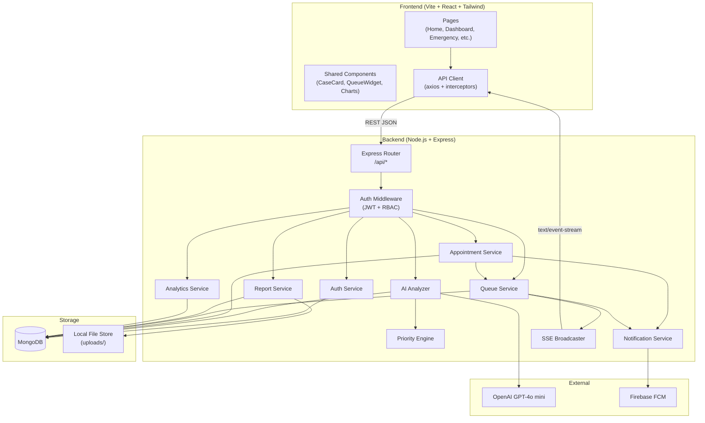

# Design Document: Smart Diagnosis Center

## Overview

The Smart Diagnosis Center is a full-stack medical triage web application. Patients submit symptoms and receive AI-powered analysis, automatic priority classification, doctor assignment, and real-time queue tracking. Doctors and admins manage cases through a live dashboard with analytics and emergency alerting.

The system is split into two independently deployable units:
- **Frontend**: Vite + React 19 + Tailwind CSS (existing scaffold at `frontend/diagnosis center/`)
- **Backend**: Node.js + Express REST API (to be created at `backend/`)

Communication is via JSON REST APIs. Real-time updates use server-sent events (SSE) for the dashboard and queue — a lightweight alternative to WebSockets that works over standard HTTP and requires no additional infrastructure.

**Key technology choices:**
- `openai` npm package (v4+) for GPT-4o mini integration
- `firebase-admin` SDK for FCM push notifications
- `multer` for file uploads; `pdf-lib` + `sharp` for image-to-PDF conversion
- `jsonwebtoken` + `bcrypt` for auth
- `mongoose` for MongoDB ODM
- `vitest` + `fast-check` for property-based testing

---

## Architecture



### Request Lifecycle

1. Frontend sends HTTP request with `Authorization: Bearer <jwt>` header.
2. Auth middleware validates JWT and attaches `req.user` (id, role).
3. Route handler delegates to the appropriate service module.
4. Service interacts with MongoDB via Mongoose models.
5. Response is returned as `{ success, data, message }` JSON.
6. Side effects (notifications, SSE broadcasts) are triggered asynchronously.

---

## Components and Interfaces

### Auth Service (`services/authService.js`)

```js
register(name, email, password, role) → { user, token }
login(email, password) → { user, token }
hashPassword(password) → hashedString        // bcrypt, rounds=10
verifyToken(token) → decodedPayload | throws
```

### Priority Engine (`services/priorityEngine.js`)

Pure, stateless module — no I/O, no side effects.

```js
scoreSymptoms(description) → { score: Number, level: 'Emergency'|'High'|'Medium'|'Low' }
```

Keyword scoring table:

| Keywords | Score | Level |
|---|---|---|
| "breathing difficulty", "can't breathe", "shortness of breath", "difficulty breathing" | 100 | Emergency |
| "chest pain", "chest tightness", "chest pressure" | 75 | High |
| "fever", "high temperature", "high fever" | 50 | Medium |
| "cold", "runny nose", "sore throat", "cough", "sneezing" | 25 | Low |

When multiple categories match, the highest score wins. When no keywords match, default is score=25, level=Low.

### AI Analyzer (`services/aiAnalyzer.js`)

```js
analyze(symptomDescription) → {
  summary: String,
  urgencyLevel: String,
  nextSteps: String
}
```

Calls OpenAI with a structured system prompt. On API error or timeout (10s), returns a fallback object with `summary: "AI analysis temporarily unavailable"`.

System prompt template:
```
You are a medical triage assistant. Analyze the following symptom description and respond in JSON with exactly these fields:
- summary: a plain-language summary of the condition
- urgencyLevel: one of "Emergency", "High", "Medium", "Low"
- nextSteps: recommended immediate actions for the patient
Symptom description: {description}
```

### Appointment Service (`services/appointmentService.js`)

```js
createAppointment(caseId, patientId) → Appointment
cancelAppointment(appointmentId, patientId) → Appointment | throws
getPatientAppointments(patientId) → Appointment[]   // sorted asc by time
assignDoctor(priorityLevel) → Doctor | null
assignLab(priorityLevel) → 'urgent-care-lab' | 'general-lab'
```

Doctor assignment strategy:
- Emergency/High: select doctor with minimum count of active Emergency+High cases.
- Medium/Low: round-robin across available doctors (tracked via `roundRobinIndex` in memory, reset on server restart).

### Queue Service (`services/queueService.js`)

```js
enqueue(caseId, priorityLevel, submittedAt) → void
dequeue(caseId) → void
getPosition(patientId) → { position: Number, estimatedWaitMinutes: Number }
moveToFront(caseId) → void          // used by emergency alert
broadcastUpdate(patientId) → void   // triggers SSE event
```

Queue ordering: Emergency (score 100) → High (75) → Medium (50) → Low (25). Within same priority, ordered by `submittedAt` ascending (FIFO).

Estimated wait time: `(position - 1) × avgConsultationMinutes` where `avgConsultationMinutes` defaults to 15.

### Report Service (`services/reportService.js`)

```js
uploadReport(file, caseId, doctorId) → Report
downloadReport(reportId, requestingUserId, requestingUserRole) → Buffer (PDF)
convertImageToPdf(imageBuffer, mimeType) → pdfBuffer
```

File storage: `uploads/reports/{caseId}/{timestamp}-{originalname}`. Image-to-PDF conversion uses `pdf-lib` to embed the image into a new PDF page sized to the image dimensions.

### Notification Service (`services/notificationService.js`)

```js
sendToUser(userId, title, body, data) → void
sendToRole(role, title, body, data) → void   // broadcasts to all online users of a role
registerToken(userId, fcmToken) → void
```

Uses `firebase-admin` SDK's `messaging().send()` (HTTP v1 API). FCM tokens are stored on the User document.

### Analytics Service (`services/analyticsService.js`)

```js
getDailyPatientCounts(startDate, endDate) → [{ date, count }]
getDailyRevenue(startDate, endDate, consultationFee) → [{ date, revenue }]
getPriorityBreakdown(date) → { Emergency, High, Medium, Low }
```

All queries use MongoDB aggregation pipelines with `$group` by date.

### SSE Broadcaster (`services/sseBroadcaster.js`)

```js
addClient(userId, res)    // registers SSE response stream
removeClient(userId)
broadcast(userId, event, data)
broadcastToRole(role, event, data)
```

Clients connect to `GET /api/queue/stream` and `GET /api/dashboard/stream`. The server keeps a `Map<userId, res>` and writes `data: {...}\n\n` on updates.

---

## Data Models

### User

```js
{
  _id: ObjectId,
  name: String,           // required
  email: String,          // required, unique, lowercase
  passwordHash: String,   // bcrypt hash
  role: String,           // enum: ['patient', 'doctor', 'admin']
  fcmTokens: [String],    // Firebase device tokens
  isAvailable: Boolean,   // doctors only; default true
  activeHighCases: Number,// doctors only; default 0
  roundRobinIndex: Number,// internal; managed by appointment service
  createdAt: Date,
  updatedAt: Date
}
```

### Case

```js
{
  _id: ObjectId,
  patientId: ObjectId,        // ref: User
  symptomDescription: String, // required, minLength: 10
  aiAnalysis: {
    summary: String,
    urgencyLevel: String,
    nextSteps: String,
    analyzedAt: Date
  },
  symptomScore: Number,       // 25 | 50 | 75 | 100
  priorityLevel: String,      // enum: ['Low','Medium','High','Emergency']
  assignedDoctorId: ObjectId, // ref: User
  labName: String,            // 'urgent-care-lab' | 'general-lab'
  status: String,             // enum: ['pending','active','completed','cancelled']
  emergencyAlert: Boolean,    // default false
  emergencyAlertAt: Date,
  submittedAt: Date,
  updatedAt: Date
}
```

### Appointment

```js
{
  _id: ObjectId,
  caseId: ObjectId,           // ref: Case
  patientId: ObjectId,        // ref: User
  doctorId: ObjectId,         // ref: User
  labName: String,
  status: String,             // enum: ['scheduled','in-progress','completed','cancelled']
  appointmentTime: Date,      // required
  estimatedDuration: Number,  // minutes, default 15
  createdAt: Date,
  updatedAt: Date
}
```

### Report

```js
{
  _id: ObjectId,
  caseId: ObjectId,           // ref: Case
  patientId: ObjectId,        // ref: User
  doctorId: ObjectId,         // ref: User (uploader)
  filePath: String,           // server-side path
  originalName: String,
  mimeType: String,           // 'application/pdf' | 'image/jpeg' | 'image/png'
  fileSize: Number,           // bytes
  uploadedAt: Date
}
```

### QueueEntry

```js
{
  _id: ObjectId,
  caseId: ObjectId,           // ref: Case
  patientId: ObjectId,        // ref: User
  priorityLevel: String,
  symptomScore: Number,
  submittedAt: Date,
  position: Number            // computed, not stored — derived from sort order
}
```

### EmergencyLog

```js
{
  _id: ObjectId,
  patientId: ObjectId,        // ref: User
  caseId: ObjectId,           // ref: Case
  triggeredAt: Date,
  notifiedDoctors: [ObjectId]
}
```

---

## Correctness Properties

*A property is a characteristic or behavior that should hold true across all valid executions of a system — essentially, a formal statement about what the system should do. Properties serve as the bridge between human-readable specifications and machine-verifiable correctness guarantees.*

### Property 1: Valid registrations are always accepted

*For any* valid registration payload (non-empty name, valid email format, password ≥ 8 characters, role in `['patient','doctor']`), the Auth_Service SHALL return a 201 response with a user object and a signed JWT.

**Validates: Requirements 1.1**

---

### Property 2: Passwords are always stored as bcrypt hashes with cost ≥ 10

*For any* password string submitted during registration, the value stored in the database SHALL be a valid bcrypt hash whose cost factor is greater than or equal to 10, and the original plaintext SHALL NOT be stored.

**Validates: Requirements 1.3**

---

### Property 3: JWT expiry is always 24 hours

*For any* successful login, the returned JWT SHALL decode to a payload where `exp - iat` equals 86400 seconds (24 hours), regardless of the user's name, email, or role.

**Validates: Requirements 1.4**

---

### Property 4: Invalid credentials always return 401

*For any* email/password pair that does not match a registered user's credentials, the Auth_Service SHALL return a 401 Unauthorized response.

**Validates: Requirements 1.5**

---

### Property 5: Role-based access control is enforced for all protected routes

*For any* JWT with role `patient`, requests to doctor-only or admin-only routes SHALL return 403 Forbidden. *For any* JWT with role `doctor`, requests to admin-only routes SHALL return 403 Forbidden. *For any* expired or malformed token, all protected routes SHALL return 401 Unauthorized.

**Validates: Requirements 1.6, 1.7, 1.8**

---

### Property 6: Priority Engine always produces a valid score and level

*For any* symptom description string (including empty strings, unicode, and very long strings), the Priority Engine SHALL return a score that is one of `{25, 50, 75, 100}` and a level that is one of `{'Low', 'Medium', 'High', 'Emergency'}`.

**Validates: Requirements 3.1, 3.7**

---

### Property 7: Keyword matching produces correct score and level

*For any* symptom description containing at least one keyword from a defined category, the Priority Engine SHALL assign the score and level corresponding to the highest-scoring matching category. Specifically:
- Any description containing a breathing keyword → score=100, level=Emergency
- Any description containing a chest pain keyword (but no breathing keyword) → score=75, level=High
- Any description containing a fever keyword (but no higher-priority keyword) → score=50, level=Medium
- Any description containing only minor illness keywords → score=25, level=Low

**Validates: Requirements 3.2, 3.3, 3.4, 3.5, 3.6**

---

### Property 8: Symptom submission persists description, AI analysis, score, and level

*For any* valid symptom submission, the case record retrieved from MongoDB SHALL contain the original symptom description, the AI analysis result (summary, urgencyLevel, nextSteps), the computed symptom score, and the computed priority level — all matching the values produced at submission time.

**Validates: Requirements 2.4, 3.8**

---

### Property 9: Short symptom descriptions are always rejected

*For any* symptom description string with length strictly less than 10 characters (including the empty string), the system SHALL return a 400 Bad Request response with a descriptive validation message, and no case record SHALL be created.

**Validates: Requirements 2.5**

---

### Property 10: Lab assignment is always consistent with priority level

*For any* case with priority level Emergency or High, the assigned lab SHALL be `'urgent-care-lab'`. *For any* case with priority level Medium or Low, the assigned lab SHALL be `'general-lab'`.

**Validates: Requirements 4.3**

---

### Property 11: Appointment retrieval is always sorted ascending by time

*For any* patient with N appointments (N ≥ 2) at arbitrary times, the list returned by `GET /api/appointments` SHALL be sorted in ascending order by `appointmentTime`.

**Validates: Requirements 5.4**

---

### Property 12: Cancellation is allowed only when more than 1 hour remains

*For any* scheduled appointment, cancellation SHALL succeed (200) if and only if the current time is more than 60 minutes before `appointmentTime`. If the current time is within 60 minutes of `appointmentTime`, cancellation SHALL return 400.

**Validates: Requirements 5.2, 5.3**

---

### Property 13: Queue ordering respects priority then submission time

*For any* set of queue entries with varying priority levels and submission times, the queue SHALL be ordered such that: all Emergency entries precede all High entries, which precede all Medium entries, which precede all Low entries. Within the same priority level, entries SHALL be ordered by `submittedAt` ascending.

**Validates: Requirements 6.1**

---

### Property 14: Emergency alert always escalates to score=100 and level=Emergency

*For any* patient case regardless of its current priority level, triggering the emergency alert SHALL set `symptomScore` to 100, `priorityLevel` to `'Emergency'`, and move the case to position 1 in the queue.

**Validates: Requirements 7.1, 7.4**

---

### Property 15: Emergency alert is always logged with timestamp and patient ID

*For any* emergency alert trigger, an EmergencyLog record SHALL be created in the database containing the `patientId`, `caseId`, and a `triggeredAt` timestamp that is within 1 second of the trigger time.

**Validates: Requirements 7.3**

---

### Property 16: Report upload associates file with case record

*For any* valid file upload (PDF, JPEG, or PNG, ≤ 10 MB), the Report record created SHALL reference the correct `caseId` and `doctorId`, and the file SHALL be retrievable from the stored `filePath`.

**Validates: Requirements 8.1, 8.2**

---

### Property 17: Invalid file uploads are always rejected

*For any* file that exceeds 10 MB in size, or whose MIME type is not `application/pdf`, `image/jpeg`, or `image/png`, the Report_Service SHALL return a 400 Bad Request response and SHALL NOT create a Report record.

**Validates: Requirements 8.3**

---

### Property 18: Report download always returns a PDF

*For any* stored report (whether originally uploaded as PDF or image), the download endpoint SHALL return a response with `Content-Type: application/pdf`. If the original file was an image, it SHALL be converted to PDF before delivery.

**Validates: Requirements 8.4, 8.5**

---

### Property 19: Report access is restricted to assigned patient and doctor

*For any* report, a download request from a user who is neither the assigned patient nor the assigned doctor SHALL return 403 Forbidden. A download request from the assigned patient or assigned doctor SHALL succeed.

**Validates: Requirements 8.6**

---

### Property 20: Dashboard API response always contains all required case fields

*For any* active case in the system, the dashboard endpoint response SHALL include `patientName`, `priorityLevel`, `symptomScore`, `assignedDoctor`, `queuePosition`, and `appointmentStatus` for that case.

**Validates: Requirements 9.4**

---

### Property 21: Dashboard cases are always sorted by priority descending

*For any* set of active cases with varying priority levels, the dashboard endpoint SHALL return them sorted Emergency → High → Medium → Low.

**Validates: Requirements 9.1**

---

### Property 22: Analytics calculations are always correct

*For any* known set of completed appointments on a given date, the analytics endpoint SHALL return a daily patient count equal to the number of completed appointments and a daily revenue equal to `count × consultationFee`. *For any* known distribution of cases by priority level, the breakdown endpoint SHALL return counts that exactly match the actual distribution.

**Validates: Requirements 10.1, 10.2, 10.3**

---

### Property 23: All API responses have consistent JSON structure

*For any* API endpoint call (success or error), the response body SHALL be a JSON object containing exactly the fields `success` (boolean), `data` (object or null), and `message` (string).

**Validates: Requirements 12.5**

---

## Error Handling

### Global Error Middleware

All unhandled errors are caught by a global Express error handler that:
1. Logs the full error internally (never exposed to client).
2. Returns `{ success: false, data: null, message: "<user-friendly message>" }`.
3. Maps known error types to HTTP status codes:

| Error Type | Status |
|---|---|
| `ValidationError` (Mongoose) | 400 |
| `DuplicateKeyError` (MongoDB 11000) | 409 |
| `JsonWebTokenError` / `TokenExpiredError` | 401 |
| `ForbiddenError` (custom) | 403 |
| `NotFoundError` (custom) | 404 |
| All others | 500 |

### Service-Level Error Handling

- **AI Analyzer**: wraps OpenAI call in try/catch with a 10-second `AbortSignal` timeout. On failure, returns the fallback object rather than throwing — the case creation continues with the fallback analysis.
- **Notification Service**: fire-and-forget; FCM errors are logged but do not fail the primary request.
- **Report Service**: multer's `limits` option enforces the 10 MB cap before the route handler runs.
- **Queue Service**: all queue mutations are atomic at the application level (single-threaded Node.js event loop); no distributed locking needed for MVP.

### Frontend Error Handling

- Axios response interceptor catches all non-2xx responses and dispatches to a global error state.
- A `<ErrorBanner>` component renders user-friendly messages from `response.data.message`.
- Network errors (no response) show a generic "Connection error. Please try again." message.
- Loading states are managed per-request with a `useLoading` hook.

---

## Testing Strategy

### Unit Tests (Vitest)

Focus on pure logic and specific examples:
- Priority Engine: keyword matching, score computation, edge cases (empty string, mixed case, multiple matches).
- Auth Service: token generation, bcrypt hash verification.
- Analytics Service: revenue calculation, date grouping.
- Report Service: MIME type validation, file size validation.

### Property-Based Tests (Vitest + fast-check)

Each property from the Correctness Properties section is implemented as a single property-based test using `fast-check`. Minimum 100 iterations per test.

Tag format: `// Feature: smart-diagnosis-center, Property N: <property_text>`

Key generators needed:
- `fc.record({ name: fc.string(), email: fc.emailAddress(), password: fc.string({minLength:8}), role: fc.constantFrom('patient','doctor') })` — valid registration payloads
- `fc.string({ minLength: 10 })` — valid symptom descriptions
- `fc.string({ maxLength: 9 })` — invalid symptom descriptions
- `fc.constantFrom(...breathingKeywords)` combined with `fc.string()` — symptom descriptions with specific keywords
- `fc.array(fc.record({ priorityLevel: fc.constantFrom(...), submittedAt: fc.date() }))` — queue entry sets
- `fc.date({ min: new Date(Date.now() + 3700000) })` — appointment times > 1 hour in future
- `fc.date({ max: new Date(Date.now() + 3500000) })` — appointment times < 1 hour in future

### Integration Tests (Vitest + Supertest + MongoDB Memory Server)

Use `mongodb-memory-server` for an in-process MongoDB instance. Mock OpenAI and Firebase Admin with `vi.mock()`.

Key integration test scenarios:
- Full symptom submission flow: submit → AI analysis → priority scoring → case creation → queue enqueue.
- Full appointment flow: create → retrieve (sorted) → cancel (valid) → cancel (too late, expect 400).
- Emergency alert flow: trigger → case escalation → queue reorder → notification dispatch.
- Report upload/download flow: upload PDF → download → verify PDF. Upload image → download → verify PDF conversion.
- Dashboard SSE: connect to stream → submit case → verify SSE event received.

### Frontend Tests (Vitest + React Testing Library)

- Snapshot tests for CaseCard, QueueWidget, PriorityBadge components.
- Example-based tests for form validation (symptom input, registration form).
- Mock API responses to test loading states and error banner rendering.

### Test Configuration

```js
// vitest.config.js (backend)
export default {
  test: {
    environment: 'node',
    coverage: { provider: 'v8', threshold: { lines: 80 } }
  }
}
```

Property tests are tagged and run with the same `vitest` command. No separate test runner needed.

---

## API Routes Structure

All routes are prefixed with `/api`. All responses follow `{ success, data, message }`.

### `/api/auth`

| Method | Path | Auth | Description |
|---|---|---|---|
| POST | `/register` | None | Register new user |
| POST | `/login` | None | Login, returns JWT |

### `/api/symptoms`

| Method | Path | Auth | Description |
|---|---|---|---|
| POST | `/analyze` | Patient | Submit symptoms, get AI analysis + priority |

### `/api/appointments`

| Method | Path | Auth | Description |
|---|---|---|---|
| POST | `/` | Patient | Confirm appointment |
| GET | `/` | Patient | Get own appointments (sorted asc) |
| DELETE | `/:id` | Patient | Cancel appointment |
| GET | `/all` | Doctor/Admin | Get all appointments |
| PATCH | `/:id/status` | Doctor/Admin | Update appointment status |

### `/api/reports`

| Method | Path | Auth | Description |
|---|---|---|---|
| POST | `/` | Doctor | Upload report (multipart/form-data) |
| GET | `/:id` | Patient/Doctor | Download report as PDF |

### `/api/queue`

| Method | Path | Auth | Description |
|---|---|---|---|
| GET | `/position` | Patient | Get own queue position + wait time |
| GET | `/stream` | Patient | SSE stream for queue updates |
| GET | `/all` | Doctor/Admin | Get full queue |

### `/api/dashboard`

| Method | Path | Auth | Description |
|---|---|---|---|
| GET | `/cases` | Doctor/Admin | All active cases sorted by priority |
| GET | `/stream` | Doctor/Admin | SSE stream for dashboard updates |
| GET | `/analytics` | Admin | Analytics data (query params: startDate, endDate) |

### `/api/emergency`

| Method | Path | Auth | Description |
|---|---|---|---|
| POST | `/alert` | Patient | Trigger emergency alert |

### `/api/notifications`

| Method | Path | Auth | Description |
|---|---|---|---|
| POST | `/token` | Any | Register FCM device token |

---

## Frontend Page Structure

The frontend lives at `frontend/diagnosis center/src/`. Pages use React Router v6.

```
src/
├── main.jsx                  # App entry, React Router setup
├── App.jsx                   # Root layout, route definitions
├── index.css                 # Tailwind base imports
├── api/
│   └── client.js             # Axios instance with JWT interceptor
├── context/
│   ├── AuthContext.jsx        # JWT storage, user state, login/logout
│   └── NotificationContext.jsx # FCM token registration
├── hooks/
│   ├── useLoading.js
│   ├── useSSE.js              # SSE connection hook
│   └── useQueue.js
├── components/
│   ├── Navbar.jsx
│   ├── Footer.jsx
│   ├── CaseCard.jsx           # Priority-colored case display card
│   ├── PriorityBadge.jsx      # Color-coded badge (red/orange/yellow/green)
│   ├── QueueWidget.jsx        # Live queue position display
│   ├── LoadingSpinner.jsx
│   ├── ErrorBanner.jsx
│   └── charts/
│       ├── DailyPatientsChart.jsx   # Line/bar chart (recharts)
│       ├── RevenueChart.jsx
│       └── PriorityPieChart.jsx
└── pages/
    ├── Home.jsx               # Landing page, hero, feature highlights
    ├── About.jsx              # About the center
    ├── Services.jsx           # Services offered
    ├── BookAppointment.jsx    # Symptom form → AI result → confirm booking
    ├── PatientDashboard.jsx   # Appointments list, queue position, reports
    ├── DoctorDashboard.jsx    # Case list (SSE), report upload, status updates
    ├── AdminDashboard.jsx     # Analytics charts, full case/user management
    ├── Emergency.jsx          # Emergency alert button + instructions
    └── Contact.jsx            # Contact form / center info
```

### Page Responsibilities

**BookAppointment** (multi-step):
1. Step 1: Symptom description input (min 10 chars, validated client-side).
2. Step 2: Display AI analysis result and priority badge.
3. Step 3: Confirm appointment — shows assigned doctor, lab, estimated time.

**PatientDashboard**:
- `QueueWidget` subscribes to `GET /api/queue/stream` via `useSSE` hook.
- Appointments list with cancel button (disabled if < 1 hour away).
- Reports section with download links.

**DoctorDashboard**:
- Case list subscribes to `GET /api/dashboard/stream`.
- Emergency cases highlighted with red border (`border-red-500`).
- Report upload form per case (file input, 10 MB limit enforced client-side too).
- Status update dropdown per appointment.

**AdminDashboard**:
- Date range picker → fetches analytics.
- Three chart widgets: daily patients, daily revenue, priority breakdown.
- Emergency alert banner rendered when SSE event `type: 'emergency'` is received.

**Emergency**:
- Single prominent red button.
- On click: POST `/api/emergency/alert` → show confirmation + queue position.
- Displays nearest emergency contact numbers.

### Styling Conventions

- Color theme: `blue-600` / `blue-800` primary, `white` background.
- Emergency: `red-500` / `red-600` backgrounds and borders.
- High priority: `orange-400` / `orange-500`.
- Medium: `yellow-400`.
- Low: `green-400`.
- All cards use `rounded-xl shadow-md p-4` base classes.
- Responsive breakpoints: `sm:` (640px), `md:` (768px), `lg:` (1024px).

---

## Real-Time Updates

### Server-Sent Events (SSE)

SSE is chosen over WebSockets because:
- Unidirectional (server → client) is sufficient for dashboard and queue updates.
- Works over standard HTTP/1.1, no upgrade handshake.
- Native browser `EventSource` API, no client library needed.
- Simpler to implement and deploy than WebSocket servers.

**SSE endpoint pattern:**
```js
// GET /api/dashboard/stream
res.setHeader('Content-Type', 'text/event-stream')
res.setHeader('Cache-Control', 'no-cache')
res.setHeader('Connection', 'keep-alive')
sseBroadcaster.addClient(req.user.id, res)
req.on('close', () => sseBroadcaster.removeClient(req.user.id))
```

**Event types:**
- `queue-update`: `{ position, estimatedWaitMinutes }` — sent to specific patient.
- `case-update`: `{ cases: [...] }` — sent to all connected doctors/admins.
- `emergency`: `{ patientName, caseId, triggeredAt }` — sent to all doctors/admins.

**Polling fallback**: If SSE connection drops, the frontend `useSSE` hook retries with exponential backoff (1s, 2s, 4s, max 30s). The dashboard also polls `GET /api/dashboard/cases` every 5 seconds as a fallback to meet the 3-second update requirement.

---

## Firebase Notification Integration

The backend uses `firebase-admin` SDK initialized with a service account key from `FIREBASE_SERVICE_ACCOUNT_KEY` environment variable (JSON string).

```js
// services/notificationService.js
import admin from 'firebase-admin'

admin.initializeApp({
  credential: admin.credential.cert(JSON.parse(process.env.FIREBASE_SERVICE_ACCOUNT_KEY))
})

async function sendToUser(userId, title, body, data = {}) {
  const user = await User.findById(userId).select('fcmTokens')
  if (!user?.fcmTokens?.length) return
  const messages = user.fcmTokens.map(token => ({
    token, notification: { title, body }, data
  }))
  await admin.messaging().sendEach(messages)
}
```

The frontend registers the FCM token on login and sends it to `POST /api/notifications/token`. Tokens are stored in the User document's `fcmTokens` array (supports multiple devices).

---

## Backend Project Structure

```
backend/
├── server.js                 # Express app setup, middleware, error handler
├── .env                      # OPENAI_API_KEY, MONGO_URI, JWT_SECRET, FIREBASE_*
├── config/
│   └── db.js                 # Mongoose connection
├── models/
│   ├── User.js
│   ├── Case.js
│   ├── Appointment.js
│   ├── Report.js
│   ├── QueueEntry.js
│   └── EmergencyLog.js
├── services/
│   ├── authService.js
│   ├── priorityEngine.js
│   ├── aiAnalyzer.js
│   ├── appointmentService.js
│   ├── queueService.js
│   ├── reportService.js
│   ├── notificationService.js
│   ├── analyticsService.js
│   └── sseBroadcaster.js
├── middleware/
│   ├── auth.js               # JWT verification + req.user attachment
│   ├── rbac.js               # Role check middleware factory
│   └── upload.js             # Multer config (10MB, PDF/JPEG/PNG)
├── routes/
│   ├── auth.js
│   ├── symptoms.js
│   ├── appointments.js
│   ├── reports.js
│   ├── queue.js
│   ├── dashboard.js
│   ├── emergency.js
│   └── notifications.js
├── uploads/
│   └── reports/              # File storage (gitignored)
└── tests/
    ├── unit/
    │   ├── priorityEngine.test.js
    │   ├── authService.test.js
    │   └── analyticsService.test.js
    ├── property/
    │   ├── priorityEngine.property.test.js
    │   ├── auth.property.test.js
    │   ├── appointments.property.test.js
    │   ├── queue.property.test.js
    │   ├── reports.property.test.js
    │   └── analytics.property.test.js
    └── integration/
        ├── symptomFlow.test.js
        ├── appointmentFlow.test.js
        ├── emergencyFlow.test.js
        └── reportFlow.test.js
```
